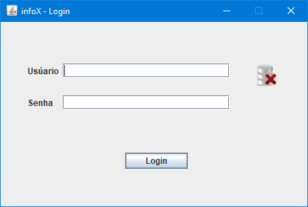
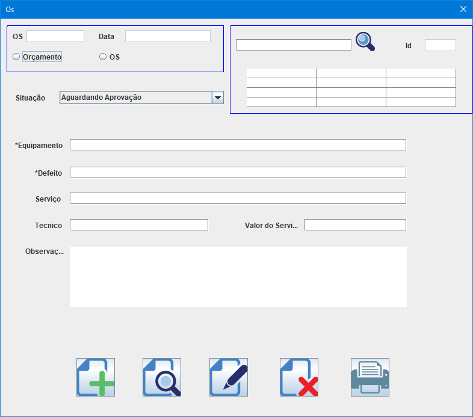
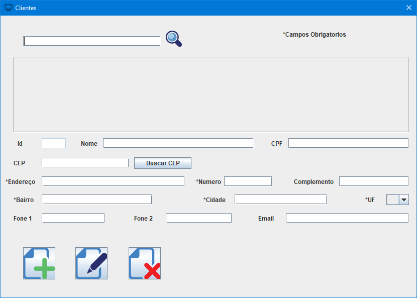
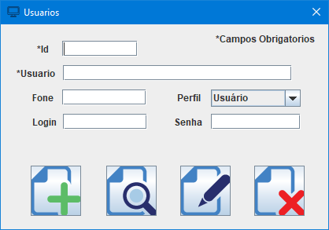
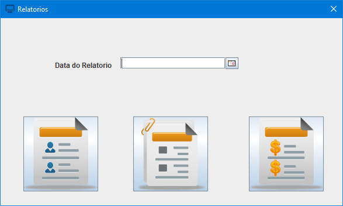

# InfoX - Gerenciador de assistência técnica
<h2>Gerenciador de Assistencia Técnica</h2> 
 

Projeto realizado em sala, na instituição Senac Tatuapé no ano de 2019

<h4>Ferrementas utilizadas</h4>

Eclipse IDE

java JDK 11.0.3

banco de dados MySql

 
<h2>Imagens do Programa</h2>
 
<h2>Imagens</h2>

 
<h2>Imagens</h2>

 
<h2>Imagens</h2>

 
<h2>Imagens</h2>

 
<h2>Imagens</h2>

 
<h2>Imagens</h2>

 

